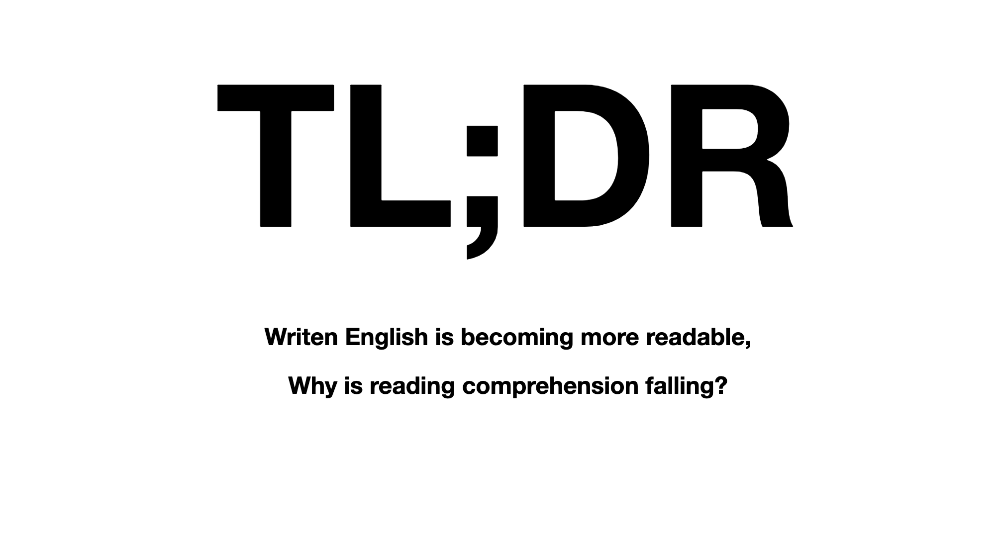

# TL;DR

### Written English is becoming more readable, why is reading comprehension falling?

By Justin Kraus

Abstract
------
Written English is becoming more readable. If written English as a whole is becoming more readable, why is there an increasing issue with reading comprehension? The author of this paper explores trends in written English and how new digital mediums have changed the way people read. These changes have consequences on reading comprehension that can be counteracted with practices that favor focused reading.

Project Preview
------

