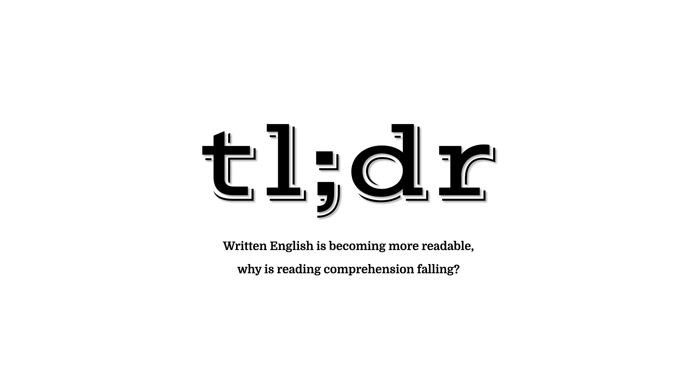

# tl;dr

### Written English is becoming more readable, why is reading comprehension falling?

By Justin Kraus

Abstract
------
Too long didn’t read explores how written English has become shorter over time, a trend known as readability. The objective of readability is to make text easier to understand. With everything becoming more readable I investigate why reading comprehension is falling with today’s students.

tl;dr can be experienced in three ways:
[Web](https://justinkraus.github.io/tldr/) | [Video](https://github.com/justinkraus/thesis/blob/main/demo.mp4) | [Text](https://github.com/justinkraus/thesis/blob/main/Justin_Kraus_Thesis.pdf)

Project Preview
------

